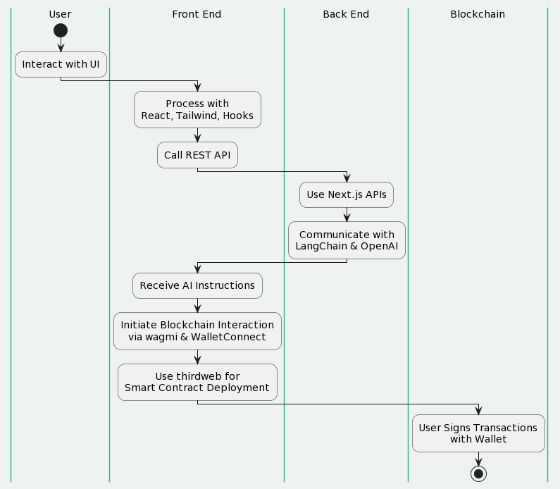

# Blockdev.ai: No-Code Smart Contract Deployment
This repo is a submission to the BNB Hackathon https://dorahacks.io/hackathon/bnbchain-hackathon/buidl

## BNBChain Hackathon Submission Requirements

- **Deployment**: Our project is deployed on the BNB Smart Chain (BSC), fully leveraging the capabilities of BNB Smart Chain. Blockdev collects necessary deployment paramters using natural language and LLMs and helps users deploy their smart contracts. As such we have multiple examples when a demo user interacts with the platform (https://testnet.bscscan.com/address/0x0c3e3B40f657e1Ea31078Ab8C97bb86d6481089f).  
- **Open Source**: Blockdev.ai is open source [MIT license](https://github.com/victaphu/blockdev.ai/blob/main/LICENSE), inviting collaboration and further innovation from the community. [GitHub Repository](https://github.com/victaphu/blockdev.ai/)
- **Artifacts**: Alongside our code, we've shared detailed planning documents, a comprehensive demo video, and engaged with the community through social media (Twitter / X).
  - [Milestones and Progress report](https://dorahacks.io/buidl/9458#milestone)
  - [Video Demo on Youtube](https://www.youtube.com/watch?v=zGuhs3Sgo0Q)
  - [Our Twitter account](https://twitter.com/Blockdevai)
  - [Our Website](https://www.blockdev.ai)
  - [Our Platform (try it out!)](https://app.blockdev.ai)
- **Transactions**: Demonstrated successful contract deployment and minting with transactions on BSC Testnet:
  - Contract Deployment: [Transaction 1](https://testnet.bscscan.com/tx/0xf6a6da284d0a9642507387016199f6cb6d8ecde0d065c6938ec99b06daf04033), [Transaction 2](https://testnet.bscscan.com/tx/0x4fc01455be91da0d995564a55e4ad0b5991632b2f5b1a84545920c90760204d5)
- **Social Engagement**: Shared our journey and project insights using #BuildonBNBChain, tagging the specific challenge. [Our Tweet](https://twitter.com/Blockdevai).  

Learn how to deploy and run Blockdev.ai locally through [Getting Started](#get-started---lets-install-and-run-blockdevai-locally)


## About Blockdev.ai

Blockdev.ai revolutionizes blockchain development, making smart contract deployment accessible to everyone. Our platform empowers users, from front-end developers to entrepreneurs, enabling them to deploy smart contracts effortlessly without needing to master Solidity or other programming languages.

### Key Features

- **User-Friendly Interface**: Intuitive chat interactions guide you through the smart contract deployment process.
- **No-Code Solution**: Simply describe your contract requirements, and Blockdev.ai generates the code for you.
- **Accessible Blockchain Development**: We're lowering the barrier to entry, making blockchain development open to a wider audience.

## Design and Usability

Blockdev.ai features a sleek, user-centric design ensuring a seamless experience. Our interface is intuitive, making navigation and contract deployment straightforward and enjoyable. Blockdev.ai will guide a user through the process of deploying smart contracts. In our POC we deploy a ThirdWeb ERC20 token, including interacting with the users' metamask, pointing users to a faucet if they don't have enough BNB testnet tokens, and helping users connect their metamask and sign any necessary transactions. Here is an example of how Blockdev.ai helps a user:


We have design blockdev.ai to be extensible. The LLM can learn the various parameters that are required for deploying a smart contract and then prompting the user for these arguments in free-text. Once the necessary arguments are obtained blockdev.ai will guide users through the process of deploying the smart contract; signing any transactions as required.

## Open Source and Collaboration

We embrace open-source principles, offering our codebase for community review, contributions, and enhancements. [View on GitHub](#).

## Innovation

Blockdev.ai introduces a unique, no-code approach to smart contract deployment. Our AI-driven platform simplifies the complexities of blockchain development, fostering innovation and accessibility. You can learn more about blockdev.ai and its roadmap items by visiting our website (https://blockdev.ai). Test out blockdev.ai POC now by visiting https://app.blockdev.ai


1. AI-Driven Conversational Interface for Smart Contract Development: Utilizes an intuitive AI companion that guides users through smart contract development via conversational prompts, significantly lowering the technical barrier to entry.

2. Zero-Code Smart Contract Deployment: Empowers users to deploy smart contracts without writing any code, making blockchain technology accessible to a wider audience, including those without programming skills.

3. Comprehensive Smart Contract Auditing and Management: Offers automated auditing for identifying security vulnerabilities in smart contracts, coupled with actionable recommendations, and provides tools for efficient decentralized application management.

4. Front-End Code Generation for DApps: Innovatively supports developers by automatically generating front-end scaffolding in JavaScript, facilitating a seamless integration between the user interface and smart contracts, thus speeding up the development cycle.

## BNB Chain Wishlist Alignment

Our project directly addresses the BNB Chain's wishlist for innovative tools that enhance accessibility and development efficiency on the BNB Chain ecosystem. Specifically, Blockdev.ai aligns well with the [Challenge: BNB Smart Chain AI generated content platform](https://github.com/bnb-chain/community-contributions/blob/main/bsc-wishlist-dapp.md#challenge-bnb-smart-chain-ai-generated-content-platform)

1. AI-Driven Platform: Blockdev.ai leverages AI to assist users in generating smart contracts, aligning with the wishlist's emphasis on AI-generated content and services.
2. Innovation in Blockchain: By making smart contract deployment accessible to non-technical users, Blockdev.ai contributes to the ecosystem's growth, inviting more participants and potential content creators.
3. Community and Ecosystem Enhancement: Blockdev.ai's open-source nature and its capability to empower users to create blockchain-based projects can foster a community of developers, content creators, and users around BNB Smart Chain, enhancing the ecosystem.
4. Tokenization and Monetization: While Blockdev.ai focuses on smart contracts, the platform's underlying technology and approach can inspire or facilitate tokenization and monetization solutions, indirectly supporting the goals of the AI-generated content platform challenge.

## Feasibility and Incubation Eligibility

Blockdev.ai is not just a concept but a fully functional platform with the potential for significant impact within the BNB ecosystem and beyond. Our project aligns perfectly with BNB Chain's wishlist, especially in promoting AI-generated content and simplifying blockchain development, indicating strong feasibility for incubation. The innovative approach of Blockdev.ai to lower entry barriers in blockchain development through AI and no-code solutions presents a unique value proposition for investors and the BNB Chain community, highlighting its potential for scalability, market fit, and long-term success. Our roadmap demonstrates a commitment to continuous improvement and adaptation to the evolving needs of the blockchain space, making Blockdev.ai an ideal candidate for incubation and investment.


### Roadmap Highlights


- **Simplify Smart Contract Development with Intuitive AI Prompts**
  - Through intuitive chat interactions, users can easily describe their contract requirements. Our AI companion, Blockdev.ai, then generates the necessary code and guides users through the deployment process, significantly simplifying blockchain development for entrepreneurs and front-end developers.

- **Streamline Development Effortlessly**
  - Intuitive Conversational Programming
  - Zero-Code Development and Deployment
  - These features make Blockdev.ai a powerful tool for anyone looking to enter the blockchain space without the need for extensive coding knowledge, fostering innovation and accessibility.

- **Create, Audit, & Manage Decentralized Applications**
  - Blockdev.ai extends its capabilities beyond smart contract creation, offering features for the management and audit of decentralized applications:
    - **Smart Contract Audits and Recommendations**: Upload existing smart contracts for Blockdev.ai to review and audit, ensuring they are secure and optimized.
    - **Front-End Code Generation**: Beyond Solidity, Blockdev.ai aids developers by generating scaffolding in JavaScript, enabling easy interaction with smart contracts.


## Codebase Efficiency

Our codebase is a testament to best practices in software development, offering clarity, functionality, and efficiency.  

1. Modular Design: Utilizing a modular architecture allows for separation of concerns, making the codebase more organized, understandable, and easier to manage. This approach facilitates independent development, testing, and reuse of modules.

2. Use of Well-Tested Libraries and Frameworks:

- React and Next.js: Leveraging these established frameworks for the front end and back end ensures a robust and efficient development process.
- Tailwind CSS: Utilizing Tailwind for styling enhances productivity and ensures consistency across the UI.
- thirdweb SDK: Incorporating thirdweb libraries for blockchain interactions guarantees that smart contract deployments are secure and efficient, benefiting from thirdweb's tested and optimized codebase.

3. Efficient Data Fetching and State Management:

- Employing hooks and REST APIs for data fetching and state management in React promotes efficient data handling and UI state synchronization.
- Server-side rendering with Next.js improves load times and SEO, enhancing the overall user experience.

4. Integration with LLMs via LangChain:

This integration showcases an innovative use of AI, making complex interactions simpler and more intuitive, thereby improving the developer experience and reducing the cognitive load on users.

5. Blockchain Integration Best Practices:

Utilizing wagmi and WalletConnect for blockchain interactions ensures a secure, user-friendly way for signing transactions, leveraging the best practices in wallet integration and user authentication.
Direct interaction from the front end, guided by back-end logic, allows users to have full control over transaction signing, aligning with security and decentralization principles.

Our architecture as follows:  



## Get Started - lets install and run BlockDev.ai locally!

Explore how Blockdev.ai can transform your blockchain development journey:

- **Website**: [https://blockdev.ai](https://blockdev.ai)
- **Demo**: [https://app.blockdev.ai](https://app.blockdev.ai)
- **Follow Us**: [Twitter](https://twitter.com/Blockdevai)
- **Video Demo**: [Youtube Demo](https://www.youtube.com/watch?v=zGuhs3Sgo0Q)

Join us in democratizing blockchain development and unleashing the potential of decentralized technologies for everyone.

## Getting Started

Before diving into Blockdev.ai, ensure you have the necessary prerequisites set up. This includes obtaining API keys from OpenAI and Thirdweb, which are crucial for the functionality of Blockdev.ai.

### Prerequisites

1. **OpenAI API Key**: Blockdev.ai uses OpenAI for its chat interaction functionalities. You'll need an API key funded with an adequate amount to support the bot's operations.
   - Create an OpenAI API key by visiting [OpenAI API](https://openai.com/api/).

2. **Thirdweb API Key and Client ID**: For blockchain interactions, Blockdev.ai leverages Thirdweb. You'll need to obtain a Thirdweb API Key and Client ID.
   - Create these by navigating to [Thirdweb Dashboard Settings](https://thirdweb.com/dashboard/settings).

### Installation

1. Clone the repository to your local machine.

```bash
git clone git@github.com:victaphu/blockdev.ai.git
cd blockdev.ai
```
2. Create a .env.local file at the root of your project directory. Populate it with your OpenAI API Key and Thirdweb credentials:
```bash
OPENAI_API_KEY=your_openai_api_key_here
THIRD_WEB_KEY=your_thirdweb_api_key_here
THIRD_WEB_CLIENT_ID=your_thirdweb_client_id_here
```
3. Install all dependencies
```bash
npm intall
```
4. Run the project in development mode
```
npm run dev
```
This will run blockdev.ai on http://localhost:3000 (depending on your environment). When you open http://localhost:3000 you can test blockdev.ai on your local machine.  

5. Deploying the Project
With your API keys in place, you're ready to deploy Blockdev.ai.  
Follow the deployment instructions tailored to your hosting service or environment. Make sure to secure your .env variables in your deployment environment.